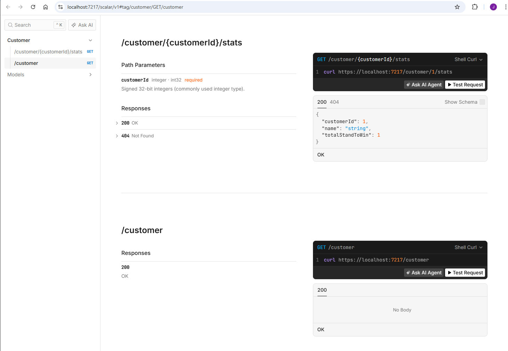

# Wagering Feed API

ASP.NET Core 9 Web API that consumes a wagering WebSocket feed in the background and exposes HTTP endpoints for customer statistics backed by an external customer API.

## Prerequisites

- .NET 9 SDK

## How to run

From the solution root (`WageringFeed`):

```bash
dotnet run --project WageringFeed.API/WageringFeed.API.csproj
```

Or open `WageringFeed.sln` in Visual Studio / Rider and start the **http** or **https** launch profile.

Default URLs (from `launchSettings.json`):

- HTTP: `http://localhost:5075`
- HTTPS: `https://localhost:7217` (when using the **https** profile)

With `ASPNETCORE_ENVIRONMENT=Development`, the app also serves:

- **Scalar** API reference (browser opens here by default): `/scalar/v1`
- **OpenAPI** document: `/openapi/v1.json`

### Run tests

```bash
dotnet test
```

Or run through Test Explorer in Visual Studio

## API overview

| Method | Route | Description |
|--------|--------|-------------|
| GET | `/customer` | Lists customers available from the in-memory store (helper for testing). |
| GET | `/customer/{customerId}/stats` | Returns aggregated stats for a customer, or `404` if customer doesn't exist in our store. |

## Wagering Feed Consumer

On startup, a hosted service (`WageringFeedConsumer`) connects to the configured WebSocket URL, receives feed messages, and dispatches them to typed handlers.

## Testing with Scalar

Scalar is only registered when `ASPNETCORE_ENVIRONMENT` is **Development** (the default **http** / **https** launch profiles set this).

1. Start the API (see [How to run](#how-to-run)).
2. Open a browser to **Scalar**, for example:
   - HTTP: [http://localhost:5075/scalar/v1](http://localhost:5075/scalar/v1)
   - HTTPS (if you use that profile): `https://localhost:7217/scalar/v1` (accept the dev certificate prompt if the browser asks).
3. In the sidebar, open **Customer** and choose an operation:
   - **GET /customer** — send the request as-is to list customer IDs currently in the store (after the feed has populated data).
   - **GET /customer/{customerId}/stats** — enter a numeric `customerId` in the path parameter, then send. You get `200` with stats or `404` if that customer id doesn't exist.



## Configuration

Settings are read from `appsettings.json`, environment variables, and other standard ASP.NET Core configuration sources.

### `WageringFeed` section

Bound to `WageringFeedOptions` in code (`SectionName` = `"WageringFeed"`).

Example (`appsettings.json`):

```json
"WageringFeed": {
  "WebSocketBaseUrl": "ws://example/ws",
  "CustomerApiBaseUrl": "http://example",
  "CandidateId": "your-candidate-id",
  "BufferSize": 1024
}
```

---

## Decisions and improvements

### Decisions
- Opted for single project for simplicity but structured folders to loosely follow clean architecture to make it easier to separate later if required
- Chose In-memory `CustomerStore` for simplicity and using concurrent dictionary. Means state is cleared every restart and safe to register as single instance shared between the WageringFeedConsumer and the CustomerService
- Total stand to win calculated on the fly and stored as a running total in dictionary with customerId as the key. Made for a simpler approach over full event sourcing or database. Downside: no replay from the store, so you can't debug calculation issues or duplicate messages as easily
- Chose Handler/Dispatcher approach to event types so can be easily extended to handle more types later
- Calling the CustomerApi within the message handler since it is only available while the feed is consuming. Means the stats are still available with customer data after the feed has been processed for that session. Downside: some overhead calling the external api during processing
- WageringFeedConsumer runs as a BackgroundService so client starts and stops with the ASP.NET Core host alongside the API

### What I would improve with more time
- The WageringFeedConsumer can't be easily tested due to its dependence on ClientWebSocket, would add abstraction like IWebSocketClient so that the websocket can be mocked for unit testing
- Separate projects to make separation cleaner
- Add auth, review security, and better response objects on customer stats API
- Have consistent and structured logging approach, maybe a correlationId for traceability. Metrics would be useful
- Store full messages to have event sourcing available to better replay events and debugging (if appropriate)
- Add resilience to the websocket consumer and httpclient, reconnect and retries
- Better test coverage and integration tests
- CandidateId is included in appsettings.json for convenience during this exercise. This shouldn't normally be committed to source control, should be supplied via an environment variable or user secrets instead
- Could look at using sealed classes and other small optimisation tweaks if needed
